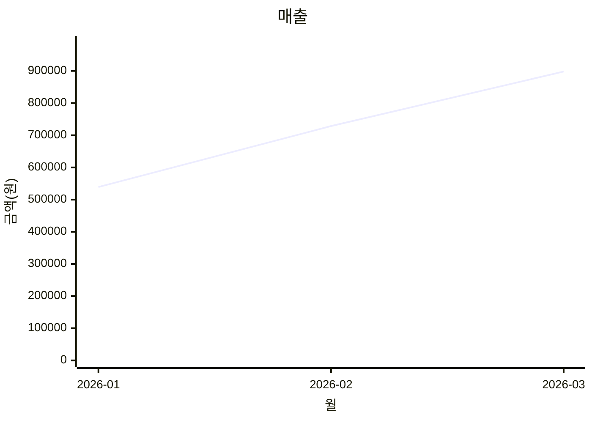
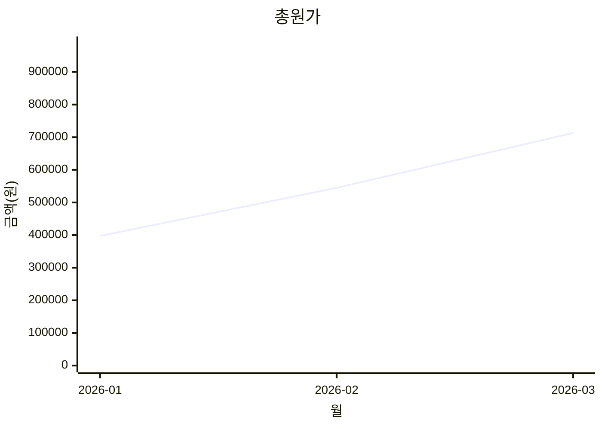
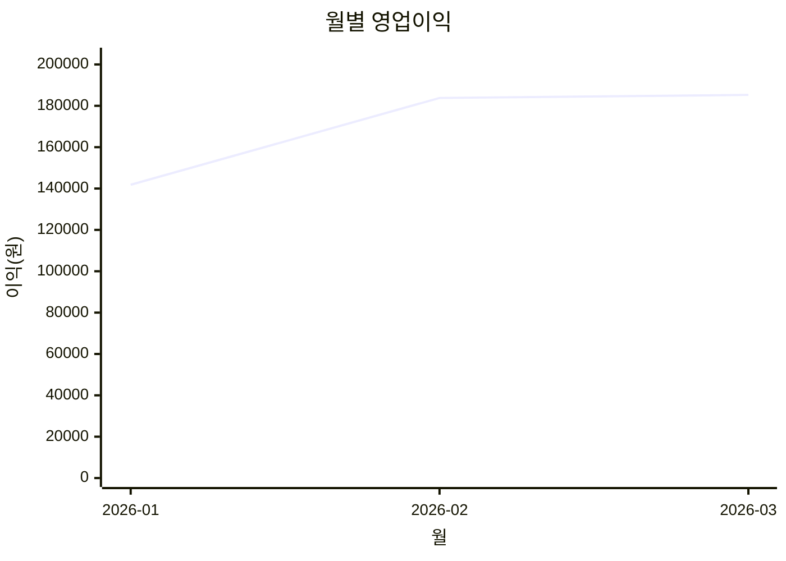

# Polite Message Rewriter 사업 보고서 (내부 전용)

작성일: 2026-03-23
대상: 대표(본인)

## 1) 서비스 한 줄 정의
감정적/공격적 문장을 관계를 해치지 않는 한국어 메시지로 즉시 변환해 주는 Chrome Extension 기반 커뮤니케이션 보조 SaaS.

## 2) 현재 제품 구성 요약
- 클라이언트: Chrome Extension (popup 입력 -> 변환 -> 복사)
- 백엔드: Node.js + Express + SQLite
- 결제/플랜: Free / Pro / Business + 10회 충전
- 인증: Google OAuth 단일 경로

## 3) 왜 Google OAuth를 쓰는가 (사업/운영 관점)
1. 무분별한 이메일 계정 생성 악용 감소
- 이메일+비밀번호 자체 가입을 막고, Google 계정 기반으로 진입 장벽을 둠
- 무료 5회 악용(계정 무한 생성) 방지에 유리

2. 온보딩 마찰 감소
- 사용자는 비밀번호를 새로 만들 필요 없이 1클릭 로그인
- 가입/로그인 문의(비번 분실) CS 비용 절감

3. 계정 신뢰도 향상
- `email_verified`를 통한 기본 신뢰 확보
- 향후 결제/분쟁 대응 시 식별 기반 강화

4. 장기 확장성
- 이후 다기기 동기화, 조직 기능, 결제계정 매칭 시 OAuth 식별자가 유리

## 4) 변환 원리 (내부 설명)
입력 텍스트를 그대로 단순 정중화하는 게 아니라, 다음 원칙으로 재작성:
- 핵심 사실/요청 보존
- 공격적/비속어/협박 뉘앙스 완화
- 관계(수신자)와 역할(발신자)에 맞는 어투 적용
- 필요 시 단호함 유지하되 표현만 예의 있게 정리
- 거짓 사실/임의 수치 추가 금지

### 내부 변환 프롬프트 (나만 확인용)
기준 파일: `backend/src/prompt.js`

#### system
```
너는 한국어 메시지를 상황에 맞게 공손하고 전달력 있게 다듬는 비서다.
출력은 최종 변환문만 제공하고, 해설이나 분석을 붙이지 않는다.
원문의 핵심 사실/요청은 유지하되 공격적 표현, 비속어, 비난, 협박성 뉘앙스는 완화한다.
메시지는 현실적인 업무/일상 커뮤니케이션 톤으로 변환한다.
거짓 사실을 추가하지 않는다. 이름/수치/사실이 없으면 임의 생성하지 않는다.
문장은 자연스러운 한국어로 정리하고 맞춤법과 띄어쓰기를 개선한다.
상대와 관계에 맞는 호칭을 사용하되 과장된 아부 표현은 피한다.
```

#### context 템플릿
```
톤: {safeTone}
수신자 유형: {safeRecipient}
발신자 역할: {role}
원문의 의도(요청, 전달사항, 불만, 경고)는 유지하되 관계 훼손 위험을 낮춰라.
필요하면 단호함은 남기되 표현만 예의 있게 바꿔라.
```

## 5) 가격/정책 (현재)
- Free: 월 5회
- Pro: 6,900원/월, 월 100회
- Business: 19,900원/월, 요청/월 토큰 무제한(1회 5,000자 제한)
- Top-up: 1,000원/10회

## 6) 수익률 현황 (샘플 월별 데이터 기준)
입력 데이터: `data/monthly_usage_finance.csv`
자동 보고서: `reports/monthly-profit-report.md`

요약:
- 평균 수익률: **24.1%**
- 적자 월: **없음**

월별:
| 월 | 매출(원) | 총원가(원) | 영업이익(원) | 수익률(%) |
|---|---:|---:|---:|---:|
| 2026-01 | 539,200 | 397,392 | 141,808 | 26.3 |
| 2026-02 | 728,600 | 544,800 | 183,800 | 25.2 |
| 2026-03 | 898,100 | 712,816 | 185,284 | 20.6 |

### 그래프 1: 월별 수익률
```mermaid
xychart-beta
  title "월별 수익률"
  x-axis "월" [2026-01,2026-02,2026-03]
  y-axis "수익률(%)" -5 --> 32
  line [26.3,25.2,20.6]
```

### 그래프 2: 매출 vs 총원가




### 그래프 3: 월별 영업이익


## 7) 적자 구조 리스크 체크
현재 샘플 데이터 기준으론 적자 월이 없음.
다만 Business 무제한 구조는 사용량 급증 시 적자 위험이 존재.

핵심 임계식:
- Business 손익분기 사용량: `N = 19900 / 요청당원가(c)`
- 실제 월 평균 Business 사용량이 이 N을 넘으면 적자 가능성 상승

## 8) 세부 실행 계획
### Phase A (사업자 등록 전)
- 제품 안정화: OAuth 로그인 성공률, 변환 실패율, 결제 전환 퍼널 계측
- 무료 5회 악용 방지 룰 고도화(디바이스/행동 패턴 기반)
- 랜딩/정책 문서 정합성 유지

### Phase B (사업자 등록 직후)
- 결제사업자 정식 연동(정기결제 자동화)
- 영수증/세금계산 이슈 대응 플로우 구축
- 고객센터 대응 템플릿 정리

### Phase C (초기 매출 확장)
- Business 플랜에 팀 기능/관리 기능 추가
- 업종별 템플릿(교육/CS/영업) 제공
- 전환율 높은 랜딩 카피 A/B 테스트

## 9) 대표용 체크리스트
- [ ] Google OAuth 환경변수/콘솔 설정 완료
- [ ] 월별 수익률 보고 자동 생성 실행
- [ ] 적자 임계치(원가/사용량) 월별 리뷰
- [ ] 사업자 등록 후 결제 정식화 일정 확정

