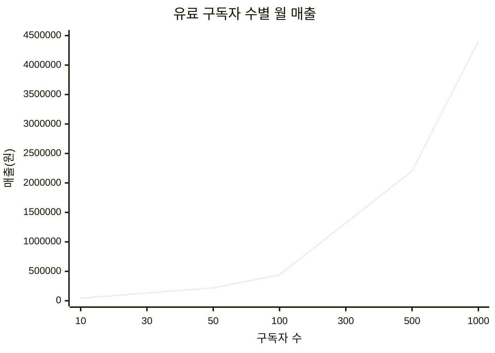
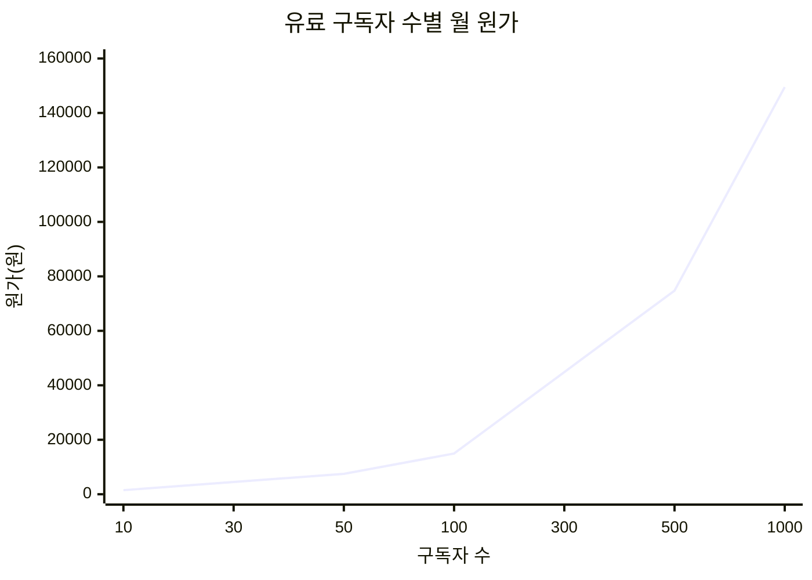
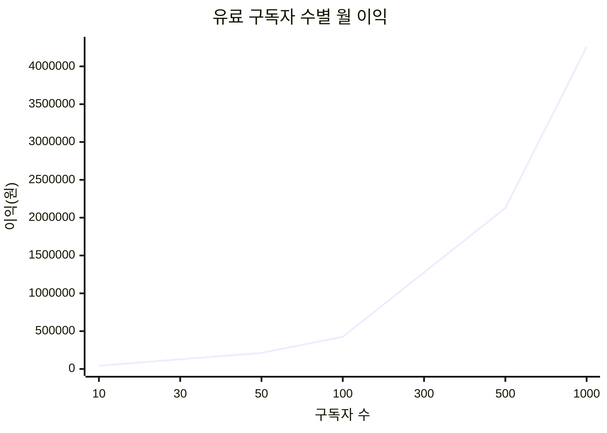

# Polite Message Rewriter 사업 보고서

작성일: 2026-03-23  
대상: 대표(본인)  
성격: 내부 전용

## 한 줄 결론
지금 구조는 `무료 3회 체험 + Google OAuth + 외부 결제 + 서버 프록시`로 가는 것이 맞다. 현재 플랜 캡 기준으로는 OpenAI 호출 원가 때문에 적자가 나는 구조는 아니다. 진짜 리스크는 모델 원가보다 `무료 악용`, `결제 자동화 미완성`, `Google/Toss 환경변수 미설정` 쪽이다.

## 1) 서비스 정의
감정적이거나 공격적인 한국어 문장을, 관계를 덜 해치고 전달력은 유지하는 정중한 메시지로 다시 써 주는 Chrome Extension 기반 SaaS.

핵심 가치:
- 말을 순화하되, 핵심 요구는 지운다기보다 정리한다.
- 상사, 동료, 고객, 학부모처럼 관계가 걸린 상황에서 즉시 쓸 수 있다.
- 사용자는 ChatGPT를 직접 열어 프롬프트를 쓰지 않아도 된다.

## 2) 현재 제품 구조
- 클라이언트: Chrome Extension popup
- 백엔드: Node.js + Express + SQLite
- 모델 호출: OpenAI API
- 무료 플랜: `Free` 총 3회, 1회 2,000자
- 유료 플랜:
  - `Pro Monthly` 4,900원/월, 월 50회, 1회 4,000자
  - `Pro Annual` 39,000원/년, 매달 100회, 1회 4,000자
- 인증: Google OAuth만 지원
- 결제: TossPayments 랜딩 페이지

## 3) 왜 Google OAuth를 쓰는가
### 사업 관점
- 이메일/비밀번호 직접 가입보다 온보딩 마찰이 낮다.
- 비밀번호 찾기, 재설정, 계정 잠금 같은 CS를 거의 없앨 수 있다.
- 무료 3회 악용을 완전히 막지는 못해도, 익명 계정보다 난이도를 올린다.

### 운영 관점
- 백엔드에서 `users` 테이블에 회원 여부를 명확히 남길 수 있다.
- `email_verified` 전제가 있어, 결제 이슈나 문의 대응이 더 쉽다.
- 이후 결제 계정, 기기, 세션을 Google 계정 기준으로 연결하기 좋다.

### 제품 관점
- 사용자는 “계정 만들기” 대신 “Google로 시작”만 누르면 된다.
- Chrome Extension에서 가장 자연스러운 로그인 UX 중 하나다.

## 4) 왜 API 키를 확장에 넣지 않는가
- 확장에 비밀키를 넣으면 사실상 배포와 동시에 노출 위험이 생긴다.
- 무료/유료 한도, 악용 차단, 계정 정지, 결제 잠금은 서버가 있어야 통제 가능하다.
- 따라서 구조는 반드시 `Extension -> Backend -> OpenAI`여야 한다.

## 5) 변환 원리
이 서비스는 단순 번역기나 단순 톤 치환기가 아니다. 핵심은 아래 다섯 가지다.

- 원문의 핵심 사실과 요구를 유지한다.
- 공격적 표현, 비속어, 비난성 표현은 낮춘다.
- 상대와 관계에 맞는 어투를 적용한다.
- 단호함이 필요한 경우 의미는 남기고 표현만 정돈한다.
- 거짓 사실이나 임의 정보는 추가하지 않는다.

즉, 목표는 “예쁘게 포장”이 아니라 “실제로 보내도 덜 망하는 문장”이다.

## 6) 내부 변환 프롬프트
기준 파일: [backend/src/prompt.js](/home/dowon/securedir/git/codex/projects/260322_polite_message_extension/backend/src/prompt.js)

### system
```text
너는 한국어 메시지를 상황에 맞게 공손하고 전달력 있게 다듬는 비서다.
출력은 최종 변환문만 제공하고, 해설이나 분석을 붙이지 않는다.
원문의 핵심 사실/요청은 유지하되 공격적 표현, 비속어, 비난, 협박성 뉘앙스는 완화한다.
메시지는 현실적인 업무/일상 커뮤니케이션 톤으로 변환한다.
거짓 사실을 추가하지 않는다. 이름/수치/사실이 없으면 임의 생성하지 않는다.
문장은 자연스러운 한국어로 정리하고 맞춤법과 띄어쓰기를 개선한다.
상대와 관계에 맞는 호칭을 사용하되 과장된 아부 표현은 피한다.
```

### context 템플릿
```text
톤: {safeTone}
수신자 유형: {safeRecipient}
발신자 역할: {role}
원문의 의도(요청, 전달사항, 불만, 경고)는 유지하되 관계 훼손 위험을 낮춰라.
필요하면 단호함은 남기되 표현만 예의 있게 바꿔라.
```

## 7) 현재 요금제 설계가 맞는 이유
### Free
- “되나 안 되나”만 확인시키는 체험 역할
- 총 3회면 품질 확인은 충분하고, 악용 비용은 작다

### Pro Monthly
- 가끔이 아니라 반복 사용이 생기는 개인 사용자용
- 월 50회는 실제 개인 사용에선 넉넉하지만 무한은 아니다

### Pro Annual
- 반복 사용이 확실한 사용자용
- 월간보다 더 넉넉한 사용량을 주되, 여전히 상한은 둔다

### 왜 무제한을 안 넣는가
- 현재 단계에서 무제한은 원가보다 abuse 리스크가 더 크다
- 상한이 있어야 비용 통제와 플랜 업그레이드가 가능하다

## 8) 원가 계산 가정
아래는 내부 추정치다. 실제 청구는 OpenAI 공식 가격과 사용 토큰에 따라 달라진다.

공식 가격 참고:
- GPT-5 mini: 입력 `$0.25 / 1M`, 출력 `$2.00 / 1M`
- GPT-5 nano: 입력 `$0.05 / 1M`, 출력 `$0.40 / 1M`

출처:
- https://openai.com/api/pricing/

### 계산 가정
- 환율 가정: `1 USD = 1,350원`
- Free 1회 평균: 입력 700t + 출력 220t, `gpt-5-nano`
- Paid 1회 평균: 입력 1,200t + 출력 350t, `gpt-5-mini`
- Paid worst-case 추정: 입력 2,000t + 출력 600t, `gpt-5-mini`

### 요청당 원가 추정
- Free 1회 원가: 약 `0.16원`
- Paid 1회 평균 원가: 약 `1.35원`
- Paid worst-case 1회 원가: 약 `2.30원`

### 플랜별 월 원가 상한
- Free 체험 1명 전부 사용: `약 0.48원`
- Pro Monthly 1명 최대 사용: `50회 x 2.30원 = 약 115원`
- Pro Annual 1명 최대 사용: `100회 x 2.30원 = 약 230원`

## 9) 적자 계산
현재 플랜 기준으로는 호출 원가 때문에 적자 나는 구조가 아니다.

손익분기 요청당 원가:
- Pro Monthly: `4,900 / 50 = 98원/회`
- Pro Annual 월환산: `3,250 / 100 = 32.5원/회`

현재 worst-case 추정 원가는 `약 2.30원/회`라서,
- Monthly는 손익분기 대비 약 `42배` 여유
- Annual도 손익분기 대비 약 `14배` 여유

즉 `모델 원가`만 보면 적자 계산은 없다.  
실제 리스크는 아래다.
- 결제 수수료
- 환불
- 무료 계정 악용
- 자동화 스팸 호출
- 운영 인프라와 CS

## 10) 구독자 수별 월 매출/원가/이익 시뮬레이션
가정:
- 유료 구독자 구성: `Monthly 70% / Annual 30%`
- Annual은 월 환산 매출 `39,000 / 12 = 3,250원`
- 원가는 worst-case 기준 사용
  - Monthly 1명당 월 원가 `115원`
  - Annual 1명당 월 원가 `230원`
- 가중 평균:
  - 1명당 월 매출 `4,405원`
  - 1명당 월 원가 `149.5원`
  - 1명당 월 이익 `4,255.5원`

### 표: 유료 구독자 수별 시뮬레이션
| 유료 구독자 수 | 월 매출(원) | 월 원가(원) | 월 이익(원) | 수익률 |
|---:|---:|---:|---:|---:|
| 10 | 44,050 | 1,495 | 42,555 | 96.6% |
| 30 | 132,150 | 4,485 | 127,665 | 96.6% |
| 50 | 220,250 | 7,475 | 212,775 | 96.6% |
| 100 | 440,500 | 14,950 | 425,550 | 96.6% |
| 300 | 1,321,500 | 44,850 | 1,276,650 | 96.6% |
| 500 | 2,202,500 | 74,750 | 2,127,750 | 96.6% |
| 1000 | 4,405,000 | 149,500 | 4,255,500 | 96.6% |

### 그래프 1: 유료 구독자 수별 월 매출


### 그래프 2: 유료 구독자 수별 월 원가


### 그래프 3: 유료 구독자 수별 월 이익


## 11) 해석
- 유료 100명만 확보해도, 모델 원가만 기준으로는 월 이익이 약 `42.5만원`
- 유료 300명대부터는 월 `127만원` 수준의 기초 이익 가능
- 호출 원가 때문에 망하는 구조는 아님
- 다만 실제 이익은 결제 수수료, 마케팅, CS, 환불, 세금 반영 후 낮아진다

## 12) 사업 리스크
### 가장 큰 리스크
- 아직 정기결제가 자동화되지 않음
- Google OAuth와 Toss 환경변수가 아직 완성되지 않음
- Chrome Web Store 심사 문구와 실제 기능이 어긋날 수 있음

### 중간 리스크
- 무료 3회 우회 계정 생성
- 악의적 반복 호출
- 지나치게 긴 문장 입력

### 낮은 리스크
- OpenAI 토큰 원가 자체

## 13) 실행 계획
### 1단계: 사업자 등록 전
- Google OAuth 환경변수 세팅
- Toss 결제 키 세팅
- 로컬 개발자 토큰으로 Free/Monthly/Annual 테스트 완료
- 웹스토어 심사 대응 문구 정리

### 2단계: 첫 결제 직전
- 결제 완료 후 플랜 전환 자동화
- 세션 만료/재로그인 UX 정리
- 결제 실패/취소 안내 문구 정리

### 3단계: 첫 30명 사용자
- 무료 -> 유료 전환율 측정
- 유료 사용자 실제 월 사용횟수 측정
- 요청당 평균 토큰 재계산
- 필요하면 요금제 재조정

## 14) 대표용 체크리스트
- [ ] Railway에 `GOOGLE_CLIENT_ID`
- [ ] Railway에 `GOOGLE_CLIENT_SECRET`
- [ ] Railway에 `GOOGLE_REDIRECT_URI`
- [ ] Railway에 `TOSS_CLIENT_KEY`
- [ ] Railway에 `TOSS_SECRET_KEY`
- [ ] Railway에 `OPENAI_API_KEY`
- [ ] 로컬 개발자 토큰 테스트
- [ ] Chrome Web Store 설명과 실제 플랜 문구 일치 확인
