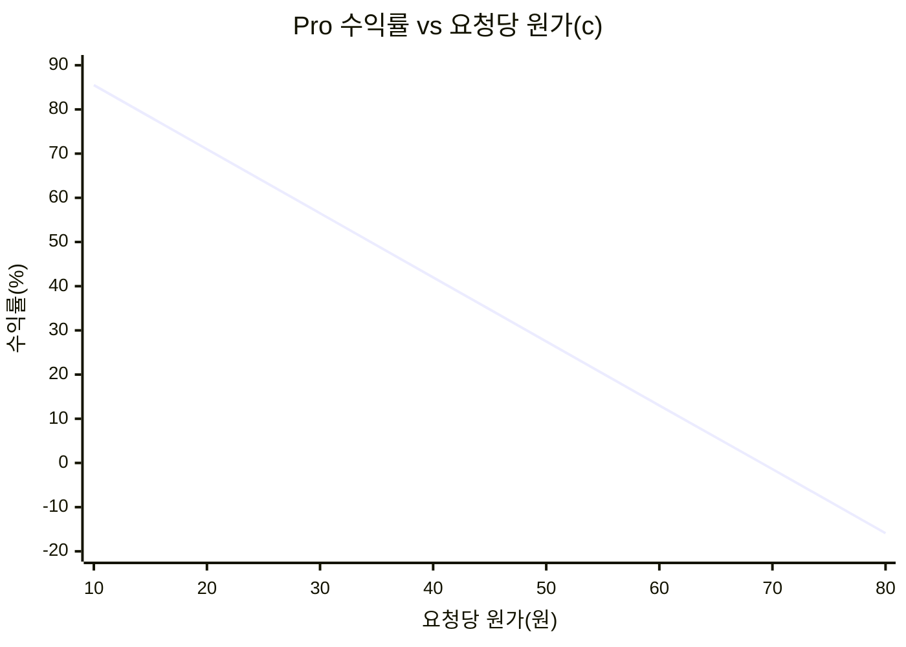
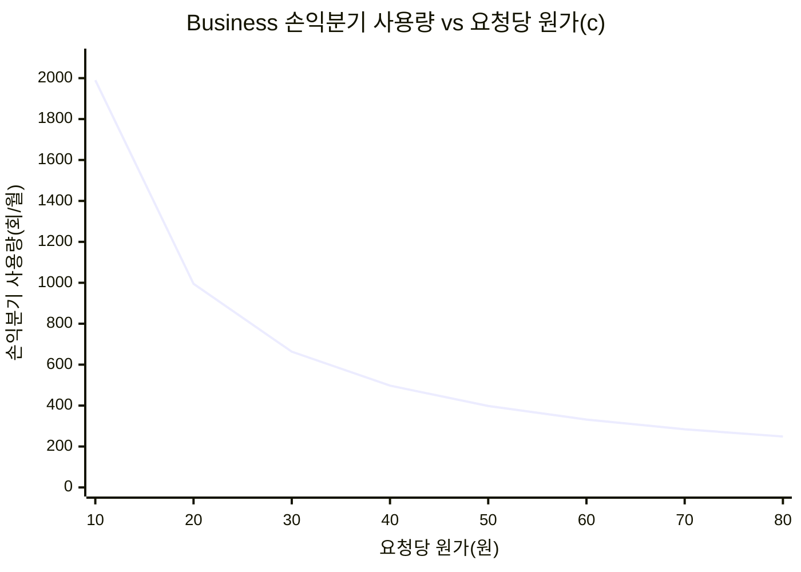

# 개인용 README: 모델/원가/수익률 메모

업데이트: 2026-03-23

## 1) 현재 모델/플랜 기준 (코드 기준)
기준 파일: `backend/src/config.js`

- Free 모델: `gpt-5-nano`
- Pro/Business 모델: `gpt-5-mini`

요금/한도:
- Free: 0원, 월 5회
- Pro: 6,900원/월, 월 100회
- Business: 19,900원/월, 요청/월토큰 무제한(1회 5,000자 제한)
- Top-up: 1,000원 / 10회

## 2) 수익률 계산식 (요청당 실제 원가 = c 원)
- Pro(월 100회 사용 가정):
  - 매출 = 6,900
  - 원가 = `100 * c`
  - 수익률 = `(6900 - 100c) / 6900`
  - 손익분기 원가: `c = 69원/요청`

- Business(월 N회 사용):
  - 매출 = 19,900
  - 원가 = `N * c`
  - 손익분기 사용량: `N = 19900 / c`

- Top-up 10회:
  - 매출 = 1,000
  - 원가 = `10 * c`
  - 손익분기 원가: `c = 100원/요청`

## 3) 그래프 A: 요청당 원가(c) 변화에 따른 Pro 수익률


## 4) 그래프 B: 요청당 원가(c) 변화에 따른 Business 손익분기 사용량
(실제 월 사용량이 이 선보다 크면 적자)


## 5) 빠른 해석
- Pro는 요청당 원가가 69원 넘으면 적자.
- Business는 무제한 구조라서, 원가와 실제 사용량이 함께 올라가면 적자 위험이 큼.
- Top-up은 요청당 원가 100원까지는 흑자.

## 6) 월별 점검 템플릿
- 입력값:
  - 실제 평균 요청당 원가(c)
  - Pro 평균 월 사용량
  - Business 평균 월 사용량
- 체크:
  - `Pro: 6900 - (100*c)`
  - `Business: 19900 - (N*c)`
  - `Topup: 1000 - (10*c)`

## 7) 자동 보고서 생성 (회계 담당용)
- 입력 CSV 템플릿:
  - `data/monthly_usage_finance.csv`
- 생성 스크립트:
  - `tools/generate_monthly_profit_report.py`
- 실행:
```bash
python3 tools/generate_monthly_profit_report.py \
  data/monthly_usage_finance.csv \
  reports/monthly-profit-report.md
```
- 출력:
  - `reports/monthly-profit-report.md` (월별 수익률 표 + Mermaid 그래프)
