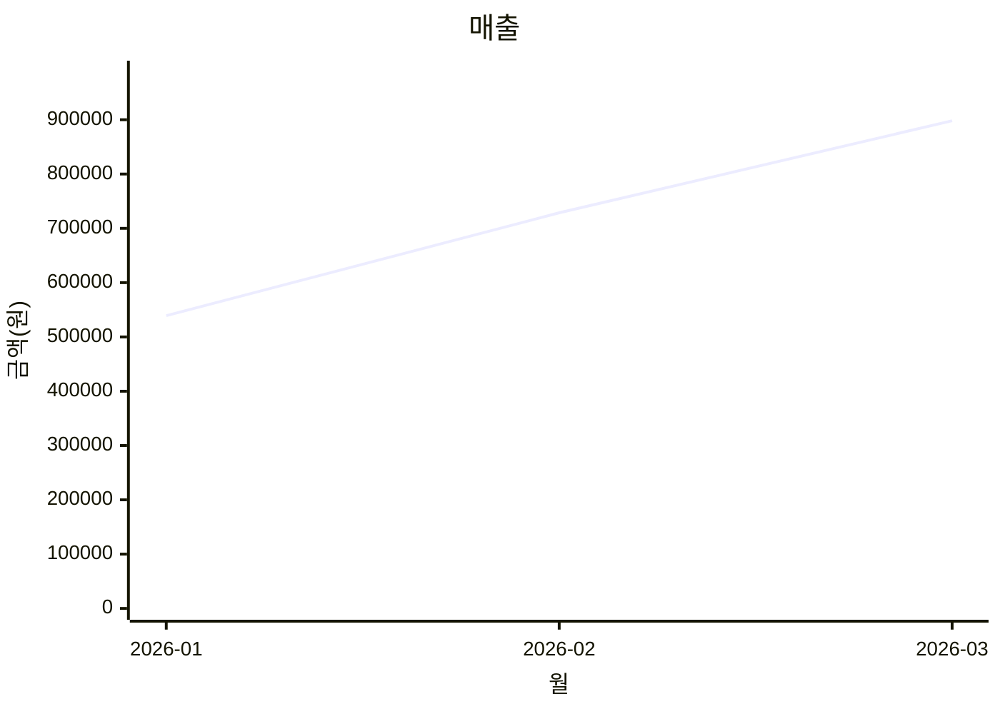
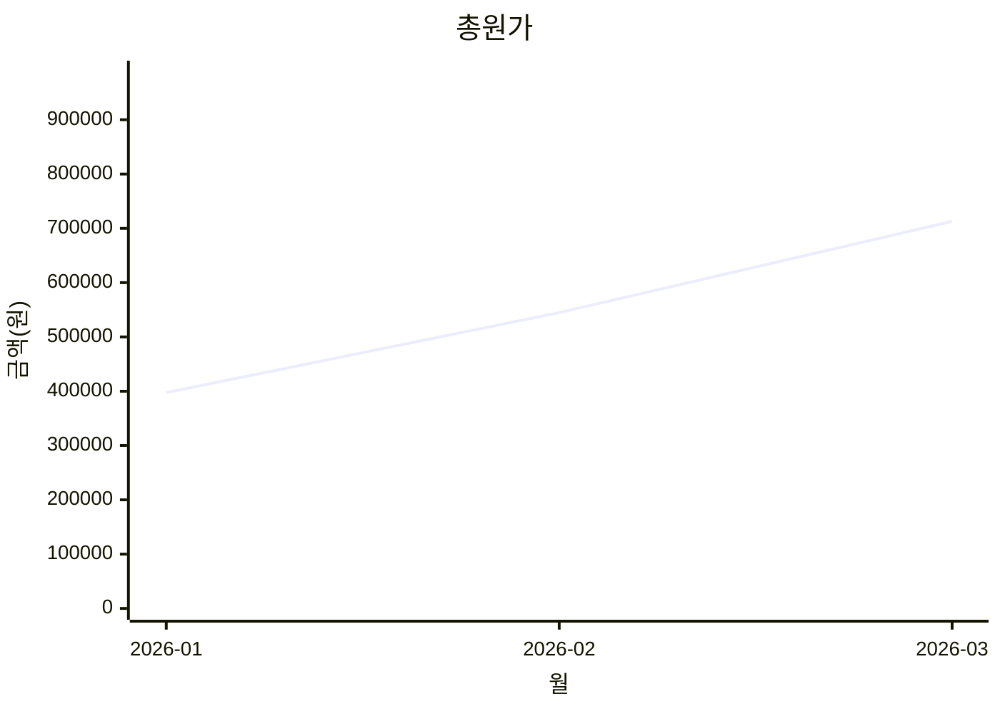
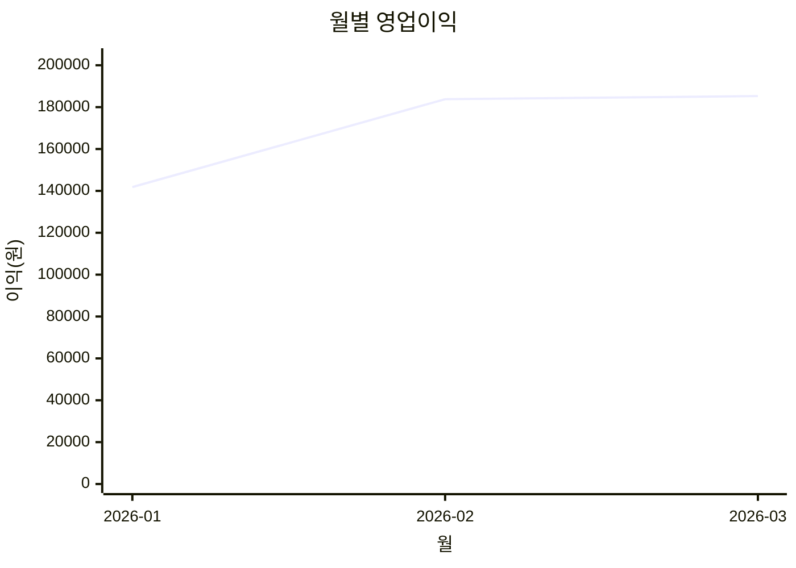

# 월별 수익률 보고서 (자동생성)

- 입력 CSV: `/home/dowon/securedir/git/codex/projects/260322_polite_message_extension/data/monthly_usage_finance.csv`
- 분석 월 수: 3
- 평균 수익률: 24.1%
- 적자 월: 없음

## 월별 요약

| 월 | 매출(원) | 총원가(원) | 영업이익(원) | 수익률(%) | 총요청수 |
|---|---:|---:|---:|---:|---:|
| 2026-01 | 539,200 | 397,392 | 141,808 | 26.3 | 5,176 |
| 2026-02 | 728,600 | 544,800 | 183,800 | 25.2 | 7,440 |
| 2026-03 | 898,100 | 712,816 | 185,284 | 20.6 | 9,642 |

## 그래프 1: 월별 수익률

```mermaid
xychart-beta
  title "월별 수익률"
  x-axis "월" [2026-01,2026-02,2026-03]
  y-axis "수익률(%)" -5 --> 32
  line [26.3,25.2,20.6]
```

## 그래프 2: 매출 vs 총원가





## 그래프 3: 영업이익



## 참고 계산

- Pro는 1인당 최대 100회까지만 비용 계산(플랜 한도 반영)
- Business는 무제한 구조이므로 실제 평균 요청 수가 수익성 핵심
- Top-up 1팩은 10회 요청 비용 반영
